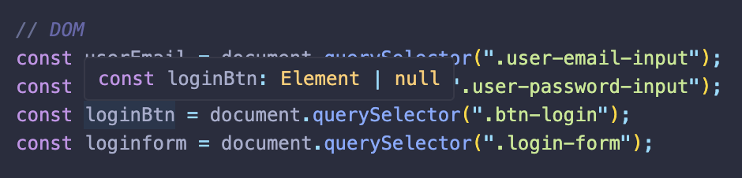
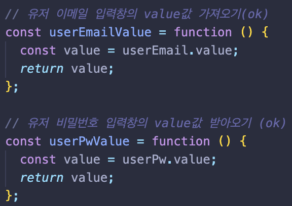
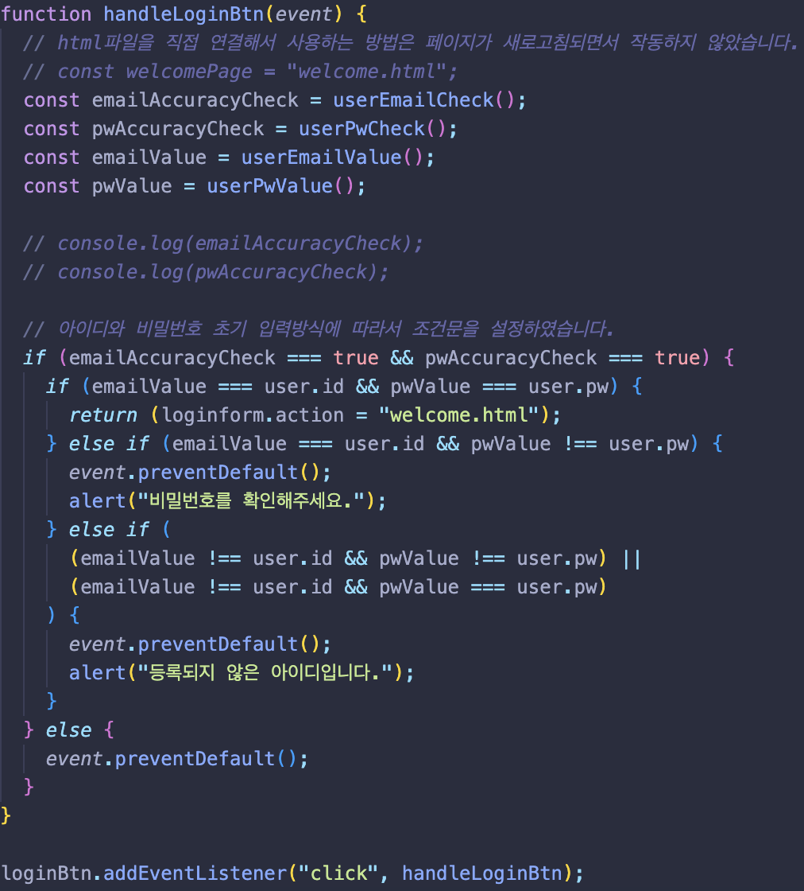

# 네이버 로그인 페이지 JS로 구현해보기

---

## 코드 리뷰

#### 1. 작업할 DOM요소를 *querySelector*를 사용하여 가져옵니다.

#### 2. input값에 들어가는 value값을 추출하는 함수를 작성하였습니다.

#### 3. 유저의 아이디와 패스워드값을 받아오는 함수를 이용하여 값을 받고, 앞서 정의한 정규식표현과 일치한지 확인 후 true false값에 의하여 *is\_\_invalid*라는 클래스를 추가 또는 제거합니다. 마지막으로 boolean값을 return합니다. (패스워드 또한 아이디와 같은 함수입니다.)

#### 4. 앞서 DOM으로 가져온 로그인버튼을 *addEventListener*를 사용해 *click이벤트*를 하였을 때 제가 설정한 함수가 작동하도록 하였습니다.

조건문은 크게 두개로, 첫번째는 사용자가 아이디와 패스워드를 정의한 정규표현식으로 잘 작성해 둘다 true값을 가질때 입니다. 둘다 true값일 경우 함수는 다음 조건문으로 사용자가 작성한 value값과 user객체에 정의한 아이디값이 같은지 확인합니다. 값이 모두 같다면 *welcome.html*페이지로 이동합니다. 만약 아이디값만 같고, 비밀번호가 일치하지 않다면 alert()메소드를 이용하여 사용자에게 비밀번호가 틀렸다는 안내를 합니다. 마지막으로 입력받은 아이디의 값이 일치하지 않는 경우, 비밀번호가 user객체와 일치하던 아니던 alert()를 이용하여 **등록되지 않은 아이디**라고 안내합니다.

다시 돌아와 아이디와 패스워드 하나라도 false를 가지거나 둘다 false라면 **event.preventDefault()**를 사용하여 HTML에서 사용한 method로 인한 이동을 막아줍니다. 그리고 로그인버튼을 클릭시 값을 받아오기 위해 실행되는 *userEmailCheck*와 *userPwCheck*함수가 실행되면서 사용자의 문제점을 클래스값을 통해 알려줍니다.

---

## 피드백

- [x] 함수를 최대한 작은 단위로 쪼개는게 좋다고 하여 직접 시도해보았습니다. (+ 전역에 변수지정은 좋지 않다고 하여 함수로 만들었습니다.)

- 생각해보니 굳이 함수로 만들기보다, 값을 필요로하는 함수마다 변수를 선언해 적는게 코드가 더 보기 좋을 것 같다는 생각을 하였습니다. ( => 콜스택과 콜백함수에 관한 지식이 필요할 것 같습니다.)

- [x] 로그인버튼 함수에 너무많은 함수가 실행됩니다. 과연 옳은 걸까요?

- 저는 사용자가 로그인버튼을 눌렀을 때 상황에 맞는 피드백을 받아야한다고 생각합니다. 만약 아이디를 압력하려고 단어하나만 입력하였을 뿐인데 '이메일형식으로 작성해주세요'라는 경고메세지를 받으면 누구라도 기분이 불쾌할 것 입니다. 여기서 문제가 생겼습니다. 로그인 버튼을 눌렀을 때 정의한 모든 함수가 실행되야 하는데, 함수 하나에 많은 함수가 실행되니 좋지 않아보이고... 아무래도 공부가 더 필요하다고 생각되는 부분이었습니다.

- [x] 깔끔하지 않은 조건문과 정체모를 변수명들

- 일단 실행은 됩니다. 그렇지만 코드를 들여다 보면 조건들이 하나같이 모두 길어 코드가 깔끔하지 않습니다. 이 부분은 다른 사람과 코드리뷰를 통해 배우는 시간을 가져야 할 것 같습니다.
